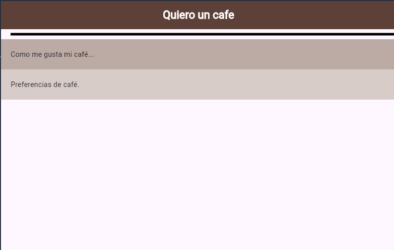
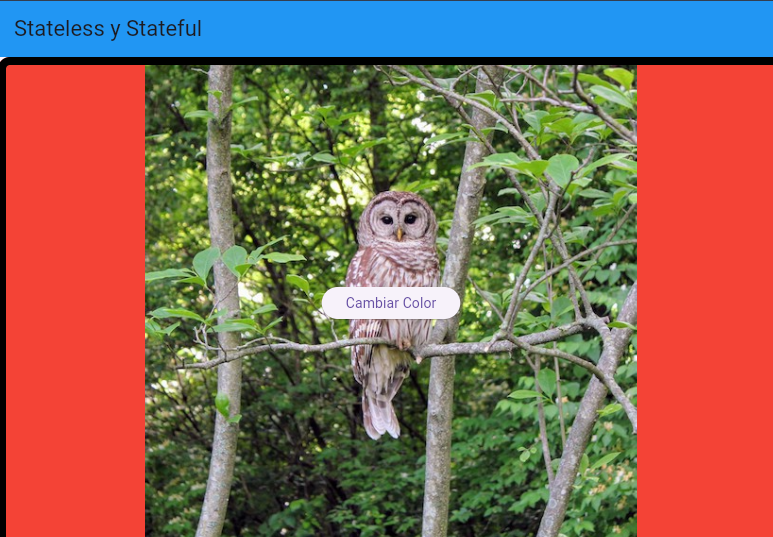

## Entrada de texto textinput
- en el nevegador busca 
- es flutter AnimatedContainer
github https://github.com/iampawan/30DaysOfFlutter/blob/day6/lib/pages/home_page.dart
## flutter oficial

[- AnimatedContainer class](https://api.flutter.dev/flutter/widgets/AnimatedContainer-class.html)

## resultados
pagina inicial

login

## referencias
[- DateTime Formatting in Flutter medium](https://medium.com/@sparkleo/mastering-datetime-formatting-in-flutter-2-techniques-2632afae62c4)

[- The official package](https://pub.dev/)

[- DateTime in Flutter with the intl Package medium](https://blog.stackademic.com/datetime-in-flutter-with-the-intl-package-4123eb926e4a)

[- Flutter ElevatedButton Example Tutorial](https://codesinsider.com/flutter-elevatedbutton-example/)
[- New Material buttons in Flutter](https://blog.logrocket.com/new-material-buttons-in-flutter/)

## videos
https://youtu.be/tF36qXam8Ok?si=xbMdC8sq2K8aNS3D

https://youtu.be/kWIrhqhCVBk?si=2ZBA1u6ZXZern3H3

https://youtu.be/yI-8QHpGIP4?si=QChxoNGO_5PVztPf

