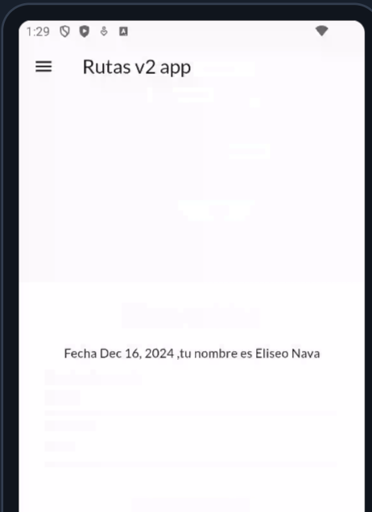

## Navigate with named routes
- en el nevegador busca 
- esflutter routes

## flutter oficial

[- https://api.flutter.dev/flutter/material/Divider-class.html](https://docs.flutter.dev/ui/widgets/interaction)

## resultados
pagina inicial

segunda pagina

## referencias
- https://medium.com/flutter/learning-flutters-new-navigation-and-routing-system-7c9068155ade

- https://medium.com/@lakshithlfvithana/a-comprehensive-guide-to-flutters-routing-system-navigating-your-way-with-ease-f8a69df1b2a8

- https://blog.devgenius.io/layouts-in-flutter-c65b0dc6b356

- https://www.dhiwise.com/post/deep-dive-into-flutter-routing-everything-you-need-to-know

## videos
https://youtu.be/DyESSzpjG4Q?si=QY37EWSLQRlnoHti

https://youtu.be/C6nTXjQFVKI?si=oneCfBkb-EWdjLfU